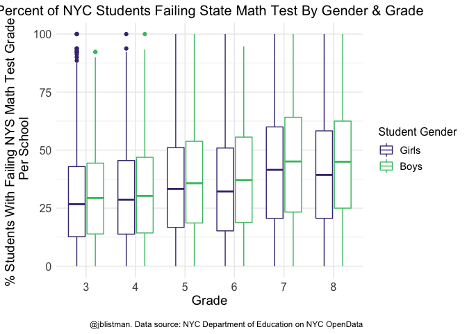
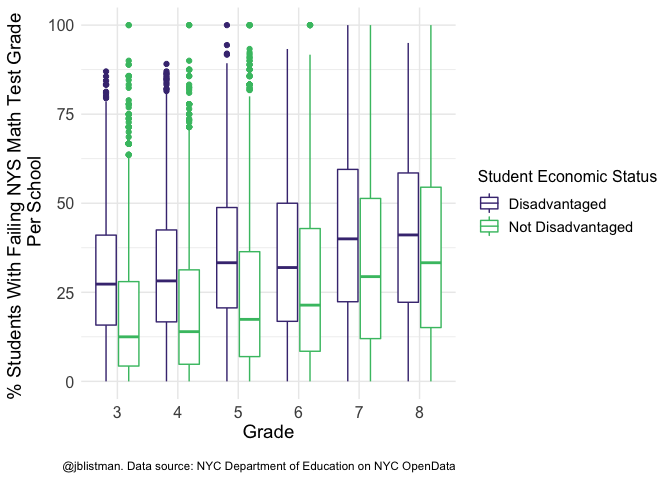
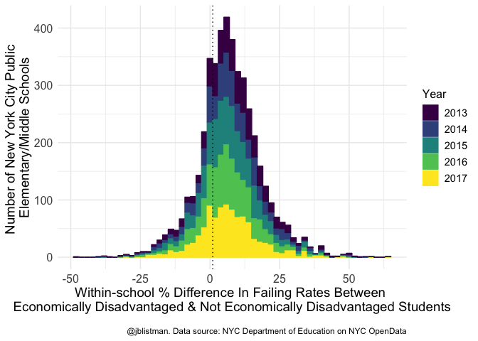

NYC\_Math
================
Jenny
11/7/2017

Load packages

``` r
library(tidyverse)
```

    ## ── Attaching packages ──────────────────────────────── tidyverse 1.2.1 ──

    ## ✔ ggplot2 3.1.0     ✔ purrr   0.2.5
    ## ✔ tibble  1.4.2     ✔ dplyr   0.7.8
    ## ✔ tidyr   0.8.2     ✔ stringr 1.3.1
    ## ✔ readr   1.2.1     ✔ forcats 0.3.0

    ## ── Conflicts ─────────────────────────────────── tidyverse_conflicts() ──
    ## ✖ dplyr::filter() masks stats::filter()
    ## ✖ dplyr::lag()    masks stats::lag()

``` r
library(ggplot2)
library(viridis)
```

    ## Loading required package: viridisLite

Load datasets

Downloaded from <https://data.cityofnewyork.us/Education/2013-2017-School-Math-Results-Gender/x4ai-kstz> <https://data.cityofnewyork.us/Education/2013-2017-School-Math-Results-Economic/9vgx-wa3i>

``` r
NYC_math_gender <- read.csv("NYC_2013_2017_SchoolMathResults_Gender.csv")
NYC_math_econ <- read.csv("NYC_2013_2017_SchoolMathResults_Economic.csv")
```

Edit variable names to make more sense

``` r
names(NYC_math_gender)[c(5,9,11,13,15,17)] = c("Gender","Level1_Percent","Level2_Percent","level3_Percent","Level4_Percent","Level3or4_Percent")

names(NYC_math_econ)[c(5,9,11,13,15,17)] = c("Econ_Status","Level1_Percent","Level2_Percent","level3_Percent","Level4_Percent","Level3or4_Percent")
```

For N students &lt; 6, scores are not reported to protect student privacy. The data sets use "s" for these missing data, so change "s" to NA.

``` r
NYC_math_gender[NYC_math_gender == "s"] <- NA
NYC_math_econ[NYC_math_econ == "s"] <- NA
```

All scores and percents are factors. Change to numeric. Years are numeric. Change to factor.

``` r
cols <- c(7:17)

NYC_math_econ[,cols] <- NYC_math_econ[,cols] %>%
        lapply(as.character) %>%
        lapply(as.numeric)

NYC_math_gender[,cols] <- NYC_math_gender[,cols] %>%
        lapply(as.character) %>%
        lapply(as.numeric)

NYC_math_econ$Year <- as.factor(NYC_math_econ$Year)

NYC_math_gender$Year <- as.factor(NYC_math_gender$Year)
```

Plot % failing per grade by gender category in a boxplot

``` r
levels(NYC_math_gender$Gender) <- c("Girls","Boys")

math_score_plot <- ggplot(subset(NYC_math_gender, Grade != "All Grades"), 
                          aes(Grade, Level1_Percent)) +
        geom_boxplot(aes(colour = Gender)) +
        theme_minimal() +
        scale_color_viridis(discrete = TRUE, option = "D", begin = 0.15, end = 0.7) +
        labs(y = "% Students With Failing NYS Math Test Grade \n Per School", x= "Grade",
             caption = "\n@jblistman. Data source: NYC Department of Education on NYC OpenData",
             colour = "Student Gender",
             title = "Percent of NYC Students Failing State Math Test By Gender & Grade") +
        theme(axis.text = element_text(size = 12),
              axis.title = element_text(size = 14),
              legend.text = element_text(size = 11),
              legend.title = element_text(size = 12),
              plot.title = element_text(hjust = 0.5, size = 15))


math_score_plot
```

    ## Warning: Removed 471 rows containing non-finite values (stat_boxplot).



Plot % failing per grade by econommic status category in a boxplot

\*\*\* switch disadvantaged and not disadvantaged in the order in which they're plotted

``` r
math_score_econ <- ggplot(subset(NYC_math_econ, Grade != "All Grades"), 
                          aes(Grade, Level1_Percent)) +
        geom_boxplot(aes(colour = Econ_Status)) +
        theme_minimal() +
        scale_color_viridis(discrete = TRUE, option = "D", begin = 0.15, end = 0.7, labels = c("Disadvantaged", "Not Disadvantaged")) +
        labs(y = "% Students With Failing NYS Math Test Grade \n Per School", x= "Grade",
             caption = "\n@jblistman. Data source: NYC Department of Education on NYC OpenData",
             colour = "Student Economic Status") +
        theme(axis.text = element_text(size = 12),
              axis.title = element_text(size = 14),
              legend.text = element_text(size = 11),
              legend.title = element_text(size = 12))

math_score_econ
```

    ## Warning: Removed 8536 rows containing non-finite values (stat_boxplot).



Create new dataframe for % failing by economic status category in All Grades. Make new variable for difference between failing % of disadvanteged - non-disadvantaged students within each school.

``` r
math_score_econ_AllGrades <- 
        subset(NYC_math_econ, Grade == "All Grades")[,c(1:5,9)] %>%
        spread(Econ_Status, Level1_Percent) %>%
        mutate(FailingDisadvantageVsNonDisadvantage = `Econ Disadv` - `Not Econ Disadv`)

names(math_score_econ_AllGrades)[5] <- "Economically Disadvantaged"
names(math_score_econ_AllGrades)[6] <- "Not Economically Disadvantaged"
```

Histogram of within-school % difference in failing rates by economic status.

``` r
within_school_econ_diff <- ggplot(math_score_econ_AllGrades, 
                          aes(FailingDisadvantageVsNonDisadvantage)) +
        geom_histogram(aes(colour=Year, fill=Year), binwidth = 2) +
        theme_minimal() +
        scale_color_viridis(discrete = TRUE, option = "D") +
        scale_fill_viridis(discrete = TRUE, option = "D") +
        geom_vline(xintercept = 1, linetype="dotted") +
        labs(y = "Number of New York City Public \nElementary/Middle Schools", 
             x = "Within-school % Difference In Failing Rates Between \nEconomically Disadvantaged & Not Economically Disadvantaged Students", 
             caption = "\n@jblistman. Data source: NYC Department of Education on NYC OpenData") +
        theme(axis.text = element_text(size = 12),
              axis.title = element_text(size = 14),
              legend.text = element_text(size = 11),
              legend.title = element_text(size = 12))

within_school_econ_diff    
```

    ## Warning: Removed 954 rows containing non-finite values (stat_bin).


