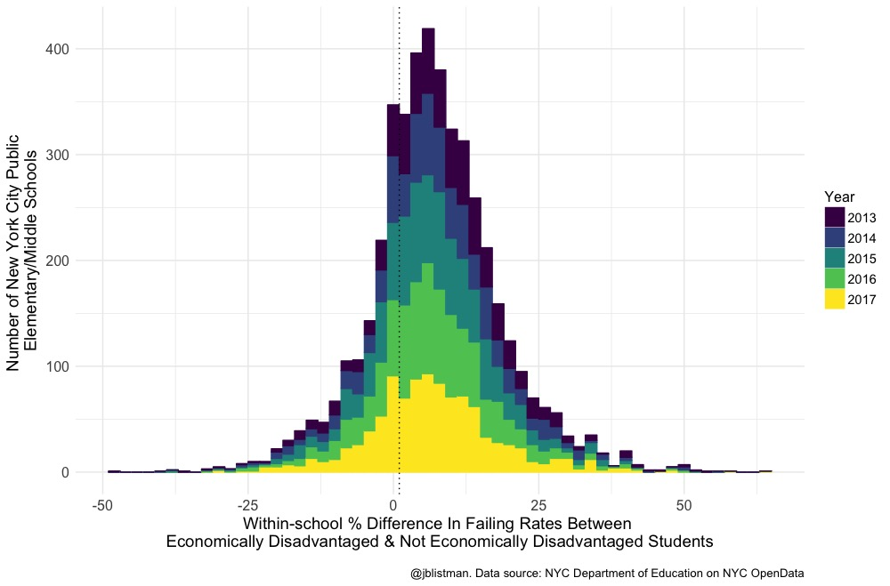

# NYC_Math_Test_Scores
Visualize NY State math test scores of NYC 3rd - 8th grade students from 2013-2017

Read a blog post summarizing the results [here](https://towardsdatascience.com/boys-low-income-students-in-nyc-more-likely-than-their-peers-to-fail-state-math-tests-3dd40798ca24). Find out more about my work [here](https://jenny-listman.netlify.com).

